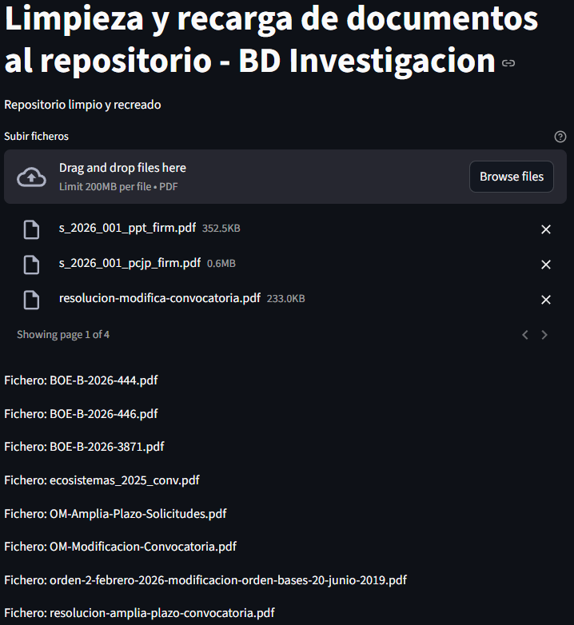
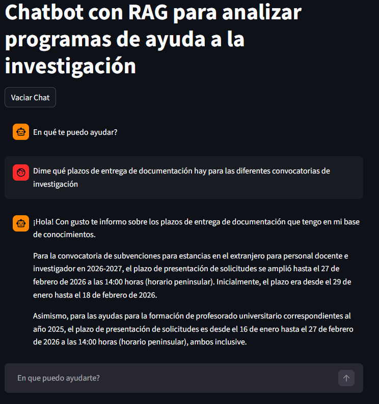

# Ejemplo funcional de uso de la API RAG con Gemini

Un chatbot sencillo de asistencia al equipo de apoyo a los investigadores, construido con la API de búsqueda de archivos de Gemini.

Este proyecto demuestra cómo construir un agente RAG (Generación Aumentada por Recuperación) que puede responder preguntas basándose en tu base de conocimiento documental, así como en un conjunto de instrucciones y configuración ajustables, según las necesidades. A nivel de interfaz de usuarios, tiene dos grandes partes, una para gestionar (borrar y cargar *corpus documental*, que actúa como base de conocimientos), y otra interfaz que usa dicho *corpus* y, en base a las instrucciones suministradas, permite interactuar con la base de conocimientos como un chatbot, similar por ejemplo a las interfaces típicas de ChatGPT o Google Gemini, permitiendo encadenar una conversación con múltiples preguntas y respuestas.

El aspecto de la interfaz con la que podemos gestionar el *corpus documental* (base de conocimientos para la IA) sería este:

 

 Y el aspecto de la interfaz del *chat bot* sería este:

 

 El motor de IA utilizado en este ejemplo el Gemini (probado con la versión 2.5 flash, pero puede cambiarse) y el motor de API de repositorio vectorial de Google, asociado.


## Inicio rápido

### 1. Prerrequisitos
- Instalar entorno [Python](https://www.python.org/downloads/windows/) (3.13 o superior)
- Clave de API de Gemini AI ([obtener aquí](https://aistudio.google.com/app/apikey))

### 2. Instalación
Creamos entorno virtual de Python en la carpeta del proyecto e instalamos los paquetes indicados en el fichero de requerimientos:

```bash
python -m venv .venv
```
Activar el entorno virtual en Windows (salvo que se use entorno de codificación como Visual Studio, por ejemplo, y se configure ahí):
```bash
.venv\Scripts\activate
```
A partir de ahí, ya podemos lanzar tanto el gestor del *corpus* como el *chat bot* (ejecutar solo uno cada vez, se desplegarán en la misma URL):
```bash
streamlit run storage_handling.py  #comando para ejecutar gestor de corpus documental

streamlit run chat.py              #comando para ejecutar el chatbot
```

### 3. Configuración del entorno

Crea un archivo `.env` con tu clave de API, aquí incluimos los valores dados como ejemplo inicial, pero que pueden alterarse según las necesidades:

```conf
GEMINI_API_KEY="your-api-key-here"    #este valor debe obtenerse en google
IA_MODEL="gemini-2.5-flash"
STORE_NAME="convoc_investig"
DISPLAY_NAME="BD Investigacion"
FICH_INSTRUCCIONES_IA="ia-instructions-convoc-inv.txt"
```

Adicionalmente, hay que ajustar, si se considera necesario, el fichero con las instrucciones para el agente IA utilizado, según se indica en la ruta en las propiedades anteriores. En este caso, `ia-instructions-conv-inv.txt`, pero se pueden definir varios y ajustar cuál usa el agente en el fichero `.env`, según se especifica en este mismo apartado.

### 4. Ejecución / visualización de la interfaz de usuario

La aplicación se abrirá en ambos casos en tu navegador en `http://localhost:8501`. Si por cualquier motivo se necesita ejecutar ambos a la vez, como por ejemplo para poder ir ajustando el *corpus* mientras se va interrogando al chatbot, usar por ejemplo estos comandos, en terminales diferentes:

```bash
streamlit run storage_handling.py --server.port 8501
```
```bash
streamlit run chat.py --server.port 8502
```

Ajustar los puertos que se quieran usar según preferencias o necesidades.
