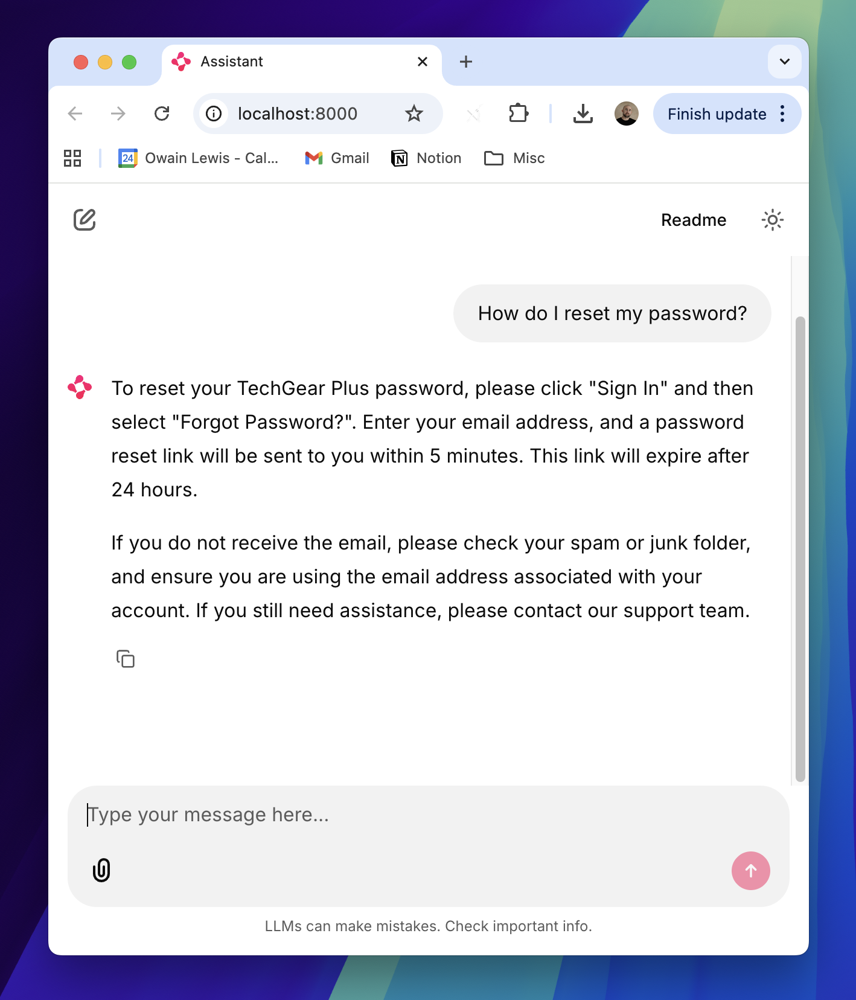

# Ejemplo funcional de uso de la API RAG con Gemini

Un chatbot sencillo de atención al cliente construido con la API de búsqueda de archivos de Gemini.

Este proyecto demuestra cómo construir un agente RAG (Generación Aumentada por Recuperación) que puede responder preguntas basándose en tu base de conocimiento documental.



NOTA: Este agente utiliza únicamente búsqueda semántica. Para algunos casos de uso esto funciona, pero en otros puede que también necesites una estrategia RAG más avanzada, como por ejemplo:

1. Leer los documentos completos referenciados para evitar perder contexto  
2. Utilizar una estrategia de búsqueda híbrida para coincidencia por palabras clave  

## Inicio rápido

### 1. Prerrequisitos
- Gestor de paquetes uv  
- Clave de API de Gemini AI  

### 2. Instalación

```
uv sync
```

### 3. Configuración del entorno

Crea un archivo `.env` con tu clave de API:

```bash
GEMINI_API_KEY="your-api-key-here"
STORE_NAME="your-store-name-here"
```

### 4. Crear el almacén de búsqueda de archivos

Ejecuta el script de configuración para crear un nuevo almacén y subir documentos al mismo:

```bash
uv run setup.py
```

Esto realizará lo siguiente:
- Creará un almacén de búsqueda de archivos  
- Subirá todos los PDFs del directorio `docs_investigacion/`  
- Ejecutará una consulta de ejemplo  
- Mostrará el nombre del almacén (guárdalo para tu archivo `.env`)  

### 5. Ejecutar la aplicación en local

```bash
uv run streamlit run app.py
```

La aplicación se abrirá en tu navegador en `http://localhost:8501`

## Estructura del proyecto

```
03-gemini-files-api/
├── app/
│   ├── agent.py              # Clase FAQAgent
│   └── services/
│       ├── file_service.py   # Operaciones de búsqueda de archivos
│       └── store_service.py  # Gestión del almacén
├── docs/                     # PDFs de la base de conocimiento
├── app.py                    # Aplicación Streamlit
├── setup.py                  # Script de configuración para crear almacenes
├── pyproject.toml            # Dependencias del proyecto
```

## Referencia de la API

Consulta la documentación oficial de la API de búsqueda de archivos de Gemini:
https://ai.google.dev/gemini-api/docs/file-search
